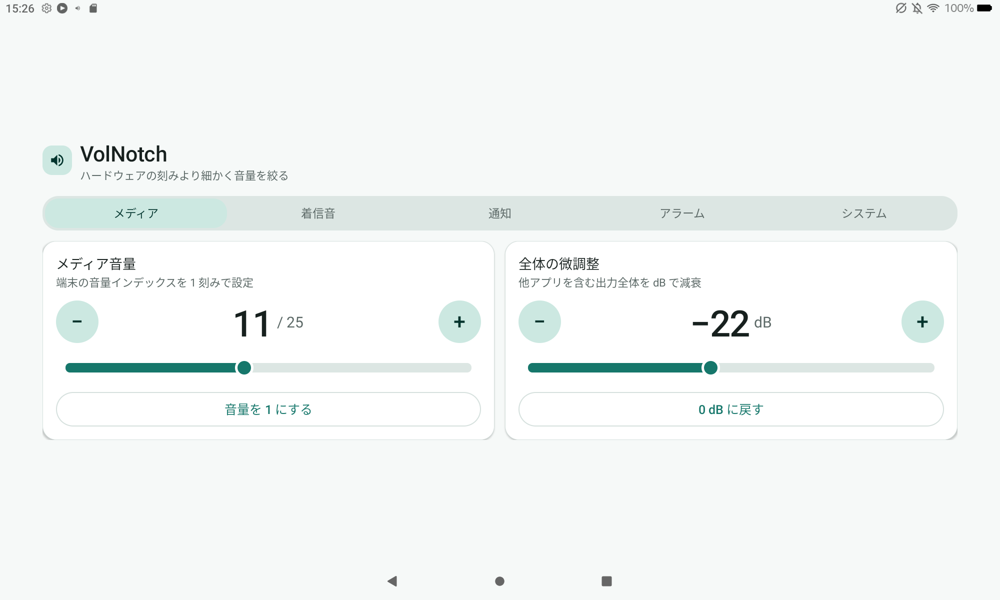

# VolNotch 🔉

**Amazon Fire タブレット（Fire OS 7 以降）のメディア音量を細かく下げるための小さな補助アプリ** — Fire Max 11 で動作確認済み

<p align="center">
  
</p>

Fire タブレットのメディア音量は内部的に十数〜25 段階程度しかなく（例: **Fire Max 11 は 25 段階** ＝ 0〜100 換算で 1 段階が約 4 ＝ 4%）、ハードウェアの音量ボタンではこの刻みより細かく変えられません。VolNotch は **音量インデックスを 1 刻みで直接指定**でき、さらに **出力全体を dB 単位で減衰**することで、最小インデックス（例: 25 段階なら 1 ≒ 4%）よりも小さく絞れます。最大インデックスは端末ごとに `getStreamMaxVolume` で自動取得するため、機種に依存しません。Google Play Services 不要・サイドロードで動作します。

---

> ## ⚠️ 免責事項 — 必ずお読みください
>
> 本アプリは **MIT ライセンス**のもと **現状有姿（AS IS）** で提供される個人制作物です。
>
> - **利用はすべて完全な自己責任**です。
> - **作者および本リポジトリの提供者は、本アプリの使用・誤用・不具合によって生じたいかなる損害についても一切の責任を負いません。** これには、端末の不具合、データの損失、**大音量による聴覚障害を含む健康被害**、その他直接・間接を問わずあらゆる損害が含まれます。
> - 本アプリは**音量・音声出力を操作する性質上、環境や端末によっては予期せぬ大音量が出る可能性**があります。イヤホン使用時などは特にご注意ください。
> - 動作の保証は一切ありません。ご自身の判断と責任においてご利用ください。
>
> **上記に同意できない場合は、ダウンロード・インストール・使用をしないでください。**

---

## 📥 ダウンロード

ビルド済みの APK は **[Releases](../../releases)** から入手できます（GitHub アカウントなしでダウンロード可）。

- **latest**: `main` の最新ビルド（`VolNotch.apk`）
- **v タグ**: バージョン付きビルド（`VolNotch-vX.Y.Z.apk`）

> APK は **release 署名**です（サイドロード用途で問題なくインストールできます）。
>
> ⚠️ **2026-08 以前の debug 署名版を入れている方へ:** 署名が変わったため上書きインストールできません。一度アンインストールしてからインストールしてください。
>
> ⚠️ **Amazon Appstore 版とは共存できません。** Amazon はアップロードされた APK の署名を Amazon 側の署名に差し替えるため、Releases 版と Amazon 版は同じ端末に同時にインストールできず、上書き更新もできません。乗り換える場合は一度アンインストールしてください。

## 📲 インストール（サイドロード）

1. `VolNotch.apk` を Fire タブレットに転送（クラウド / USB メモリ / ダウンロード等）。
2. Fire 側で **設定 → セキュリティとプライバシー → 不明ソースからのアプリ** を許可。
3. ファイルマネージャで APK をタップしてインストール。

## 🕹 使い方

### 粗調整（1 刻み）
1. 起動すると、選択中ストリーム（既定＝メディア）の現在音量が `現在値 / 最大値` で大きく表示されます。
2. 上部の **セグメント**で対象ストリーム（メディア / 着信音 / 通知 / アラーム / システム）を切り替え。
3. **スライダー**を 1 刻みで動かす、または値の左右の **「−」「+」**・**「音量を 1 にする」** で調整。
4. 物理ボタンや他アプリで音量が変わっても、表示は自動で追従します。

### 全体の微調整（もっと小さく）
5. **「全体の微調整」** カード（横向きでは右側、縦向きでは下側）のスライダー / **「−」「+」**・**「0 dB に戻す」** で、出力全体を dB 単位で減衰できます（`1` でもまだ大きいときに使用）。
6. 減衰中は通知 **「VolNotch 全体減衰: −X dB」** が常駐し、**他アプリ使用中や本アプリを閉じても維持**されます。通知の **「解除」** か **「0 dB に戻す」** で停止します。

> 💡 メディア最大インデックスは機種依存です（例: Fire Max 11 は **25**）。段階が粗く「最小の 1」でも音が出るため、より静かにしたいときは「全体の微調整」を併用してください。
> なお「全体の微調整」は端末が対応していない場合、カード内に「この端末では全体の微調整を使用できません」と表示され無効化されます（Fire Max 11 では動作確認済み）。

---

## 🛠 ソースからビルドする（開発者向け）

CI（GitHub Actions）が自動ビルドしますが、手元でビルドしたい場合は以下。

- **クイック（SDK 導入済みの場合）**
  ```bash
  ./gradlew assembleDebug
  # 生成物: app/build/outputs/apk/debug/app-debug.apk
  ```
  Gradle Wrapper（`gradlew` / `gradle-wrapper.jar`）は同梱済みで、初回に Gradle 9.3.1 を自動取得します。

- **WSL2 でゼロから環境構築する手順** … [BUILD.md](BUILD.md)（sudo 版）/ 本 README 末尾の詳細版を参照。

### 技術仕様
| 項目 | 値 |
|---|---|
| 言語 | Kotlin（AGP 9 のビルトイン Kotlin。`org.jetbrains.kotlin.android` 不要） |
| AGP / Gradle | 9.1.1 / 9.3.1 |
| JDK | 17 |
| build-tools / compileSdk | 36.0.0 / 36 |
| minSdk / targetSdk | 28 / 30（minSdk 28 = Fire OS 7 / Android 9 以降。targetSdk 30 = Fire OS 8） |
| 対応機種 | Fire OS 7・8（Android 9 / 11）の Fire タブレット。Fire Max 11 で動作確認済み |
| 外部依存 | なし（framework View のみ。AndroidX / Material ライブラリ不使用） |
| namespace / applicationId | `com.volnotch` |

---

## 📄 ライセンス

[MIT License](LICENSE) © 2026 shimasan0x00

---

<details>
<summary>WSL2 CLI でゼロから環境構築する詳細手順</summary>

### 1. JDK 17
```bash
# sudo が使える場合
sudo apt update && sudo apt install -y openjdk-17-jdk unzip wget
# sudo 不可なら ~/opt にポータブル JDK を展開（BUILD.md 参照）
```

### 2. Android cmdline-tools
```bash
mkdir -p ~/android-sdk/cmdline-tools && cd ~/android-sdk/cmdline-tools
wget https://dl.google.com/android/repository/commandlinetools-linux-14742923_latest.zip
unzip commandlinetools-linux-*.zip
mv cmdline-tools latest
```

### 3. 環境変数（`~/.bashrc`）
```bash
export ANDROID_HOME=$HOME/android-sdk
export PATH=$PATH:$ANDROID_HOME/cmdline-tools/latest/bin:$ANDROID_HOME/platform-tools
```

### 4. SDK パッケージ
```bash
yes | sdkmanager --licenses
sdkmanager "platform-tools" "platforms;android-36" "build-tools;36.0.0"
```

### 5. ビルド
```bash
echo "sdk.dir=$HOME/android-sdk" > local.properties
./gradlew assembleDebug   # 初回に Gradle 9.3.1 を自動取得
```

### Fire への adb（任意）
WSL2 は USB を直接認識しないため、`adb` 直結は不可。usbipd-win で USB パススルー、Windows 側 `adb install`、または adb over TCP/IP を利用。詳細は [BUILD.md](BUILD.md)。

</details>
